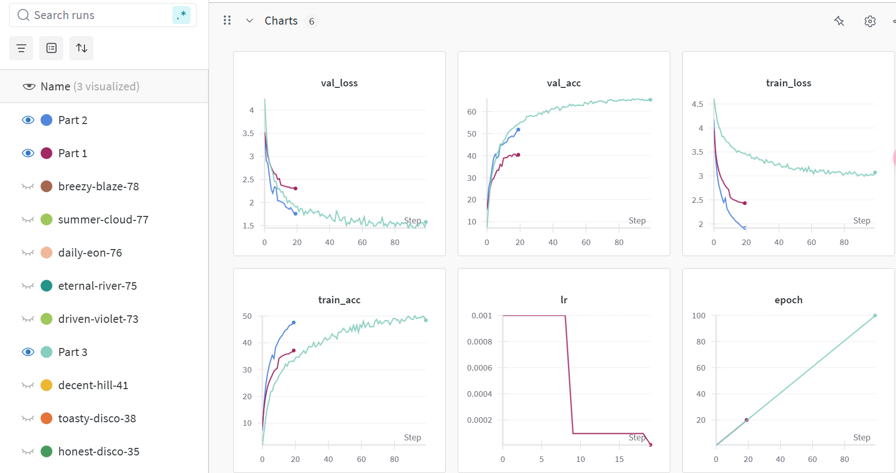

# CIFAR-100 Model Training Report

## **AI Disclosure**

I primarily used **ChatGPT** for improving the **Out-of-Distribution (OOD)** test scores by suggesting advanced regularization techniques, data augmentation methods, and hyperparameter adjustments. Additionally, ChatGPT assisted extensively with debugging various errors encountered during the training process, including CUDA-related memory errors, tensor dimension mismatches, and runtime exceptions. I also utilized ChatGPT to help convert descriptive paragraphs into Markdown-formatted text. Here are some sources that I found online feed to Chatgpt and help me generate possible tries to boost score: the [EfficientNet Paper](https://arxiv.org/abs/1905.11946), and a [WandB Experiment Tracking Guide](https://docs.wandb.ai/). Furthermore, I experimented with the ResNet101 architecture based on [ResNet101 Documentation](https://pytorch.org/hub/pytorch_vision_resnet/), but discontinued its use due to unsatisfactory OOD test results.

So most of AI assist are on part3.py. I do have complete a unqualify version of part3 myself and only achieve 0.20 score on Kaggle. Then I let ChatGPT helping me boost score step by step. But all of ideas comming from myself( Using model, tunning parameters, analysis failure tries)

---

## **1. Model Description**

This report details the training of three different models on the CIFAR-100 dataset:
1. **Simple CNN (Part 1)**: A basic convolutional neural network to establish a baseline.
2. **ResNet50 (Part 2)**: A more advanced deep learning architecture from torchvision.
3. **EfficientNet-B3 (Part 3)**: A pretrained model fine-tuned on CIFAR-100.

Each model was trained and evaluated based on accuracy and robustness.

---

## **2. Hyperparameter Tuning**

| Hyperparameter       | Simple CNN | ResNet50 | EfficientNet-B3 |
|---------------------|------------|------------|------------|
| Batch Size         | 64        | 64        | 128        |
| Learning Rate      | 0.001      | 0.001     | 0.0003     |
| Epochs            | 20         | 20         | 100        |
| Optimizer         | Adam       | Adam      | AdamW      |
| Regularization    | Dropout (0.5) | Weight Decay (1e-4) | Label Smoothing (0.1) |

The most effective configuration was found for EfficientNet-B3, with a lower learning rate and longer training duration.

---

## **3. Regularization Techniques**

Regularization techniques were extensively explored throughout this project. Initially, dropout (0.5) was implemented in the Simple CNN model to combat overfitting. For deeper architectures such as ResNet50 and EfficientNet-B3, weight decay (1e-4) proved effective in penalizing overly complex models. Additionally, advanced methods such as Stochastic Weight Averaging (SWA) and Exponential Moving Average (EMA) were adopted specifically with EfficientNet-B3 to stabilize training and boost performance on OOD tests. Label smoothing (0.1) was also used with EfficientNet-B3 to enhance generalization by preventing overly confident predictions. Attempts were also made with the ResNet101 architecture to further improve performance; however, the lack of significant improvement in OOD test scores led to discontinuing its use.

---

## **4. Data Augmentation Strategy**

| Data Augmentation | Simple CNN | ResNet50 | EfficientNet-B3 |
|------------------|------------|------------|------------|
| Random Resized Crop | ❌ | ✅ | ✅ |
| Horizontal Flip  | ✅ | ✅ | ✅ |
| Color Jitter     | ❌ | ✅ | ✅ |
| Random Rotation  | ❌ | ✅ | ✅ |
| RandAugment      | ❌ | ❌ | ✅ |

EfficientNet-B3 utilized the most extensive augmentation strategies, including advanced techniques like **RandAugment**, significantly boosting its performance.

---

## **5. Results Analysis**

The experimental results clearly demonstrate the impact of model complexity and training techniques on overall performance. The Simple CNN provided a baseline with modest accuracy (37.13% train and 40.38% validation), highlighting its limited feature extraction capabilities. ResNet50 achieved improved accuracy (47.6% train and 51.81% validation), benefiting from increased depth and more sophisticated regularization. EfficientNet-B3 outperformed all other models with the highest validation accuracy of 65.3%, underscoring the effectiveness of advanced regularization, extensive data augmentation, and transfer learning approaches.

| Model | Train Accuracy | Validation Accuracy |
|--------------|----------------|----------------|
| Simple CNN (Part 1) | 37.13% | 40.38% |
| ResNet50 (Part 2) | 47.6% | 51.81% |
| EfficientNet-B3 (Part 3) | 48.4% | 65.3% |

---

## **6. Experiment Tracking Summary**

### **WandB Tracking Results**

The WandB experiment tracking provided valuable visual insights into model performance over epochs. EfficientNet-B3 consistently showed improvements in validation accuracy and reduced loss. ResNet50 rapidly improved initially but exhibited an early plateau, possibly indicating underfitting due to insufficient epochs or overly aggressive regularization. The Simple CNN demonstrated limited performance gains, reflecting the constraints of its simplistic architecture.

---

## **7. Challenges and Potential Issues**

Throughout the project, several challenges were encountered. One primary issue was the persistent discrepancy between high training accuracy (around 99%) and poor performance on OOD tests, clearly indicating severe overfitting despite the introduction of various regularization methods. Implementing advanced techniques such as CutMix or adversarial training was identified as a potential future direction to address this.

Long training durations, often between 5-10 hours per run for the EfficientNet-B3 model, presented a significant challenge. Attempts to optimize the training pipeline through gradient accumulation, mixed-precision training, and efficient data loader settings partially alleviated this issue.

Moreover, multiple runtime errors arose during training, such as CUDA memory issues, TypeErrors in DataLoader processes, and multiprocessing pickling errors related to local lambda functions. Resolving these required methodical debugging, including adjusting batch sizes, explicitly avoiding lambda functions in multiprocessing contexts, and careful dimension matching of tensors. Debugging support from ChatGPT proved instrumental in quickly resolving these technical issues, streamlining the development and debugging processes.
